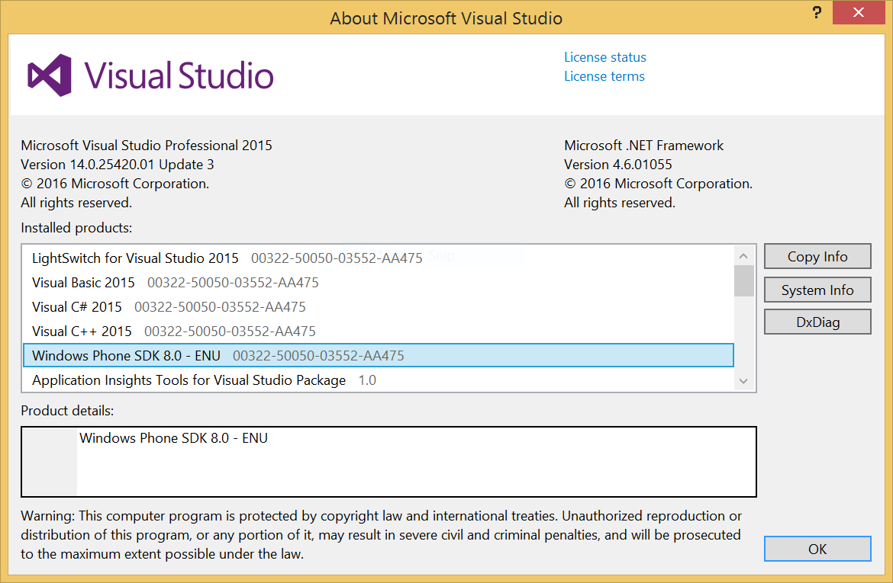
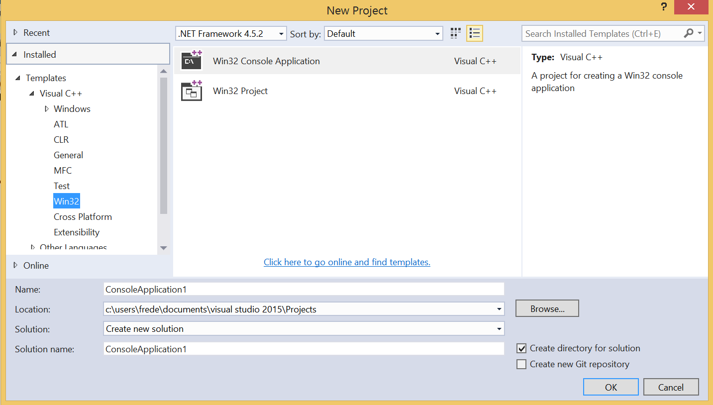
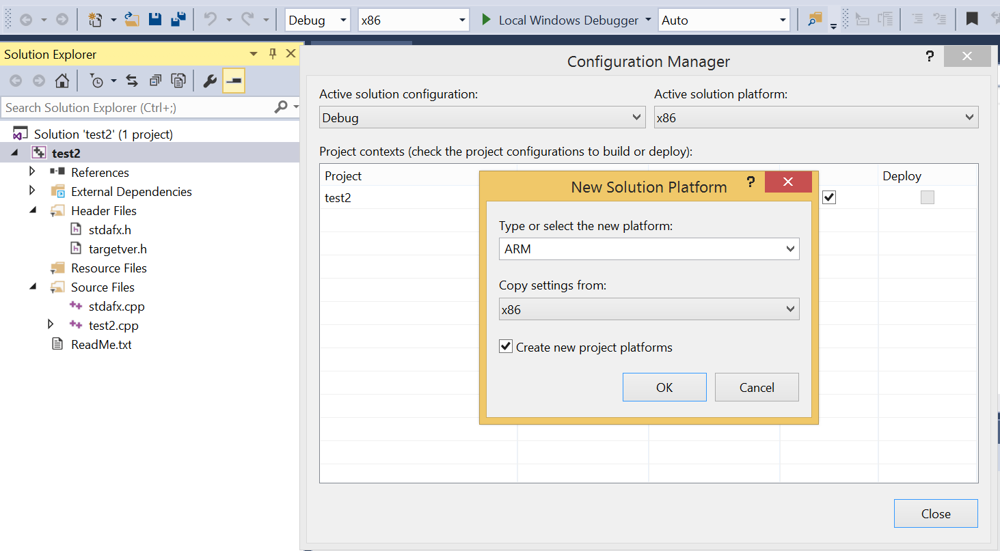
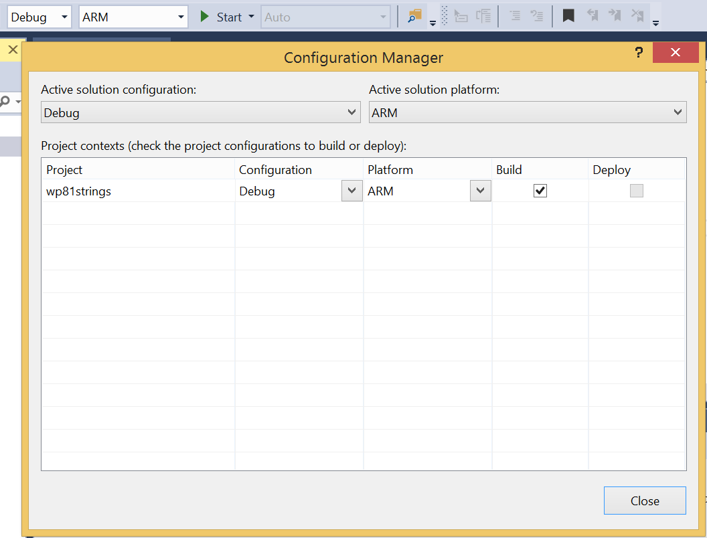
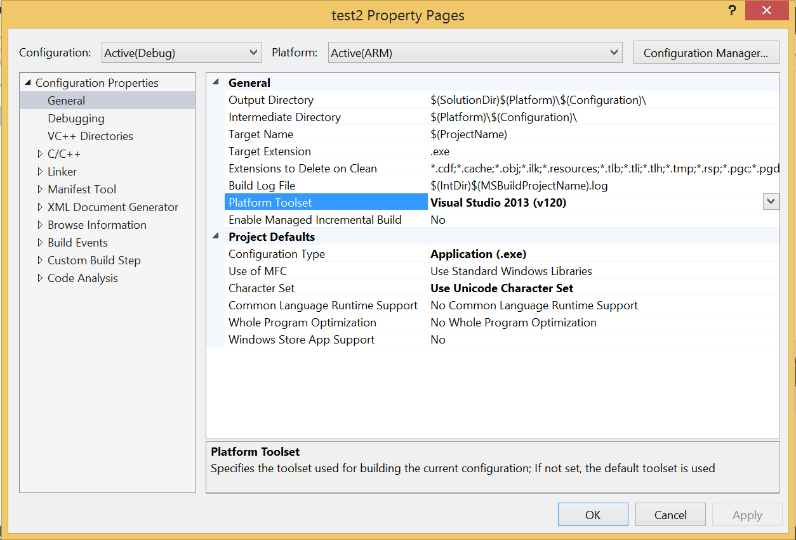
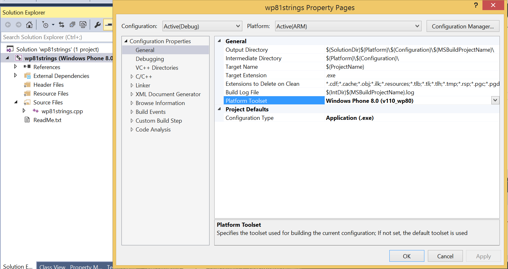
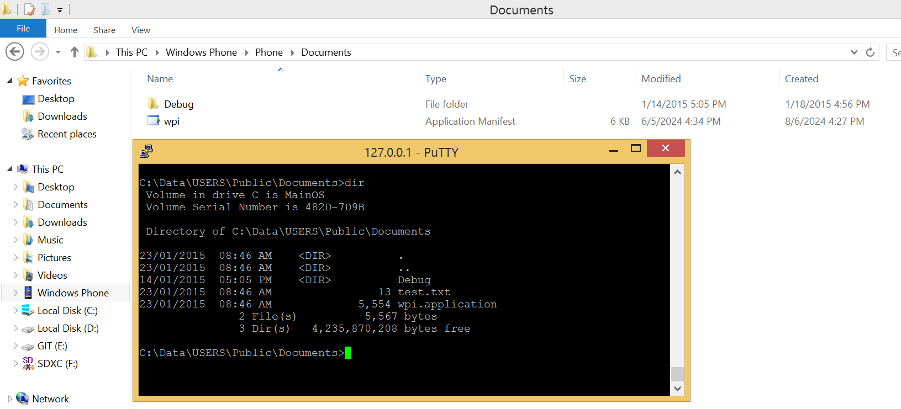

# How to build a Windows Phone console application

## Requirements

- [Install a telnet server on the phone](../telnetOverUsb/README.md), in order to run application.
- Visual Studio 2015 with the Windows Phone SDK.
  

## Create the project

Add the ARM platform.  

Change the Visual Studio version of the project (Library v110 is already present on the phone).  
First select version v120.  

Then you can select version v110 for Windows Phone.  

`C:\Program Files (x86)\Windows Kits\8.1\Lib\winv6.3\um\arm\mincore.lib`

## Deployment

Build the application with `[F7]` to generate the .exe file.  
Then manually copy this file in the shared folder of the phone: `C:\Data\USERS\Public\Documents`  

