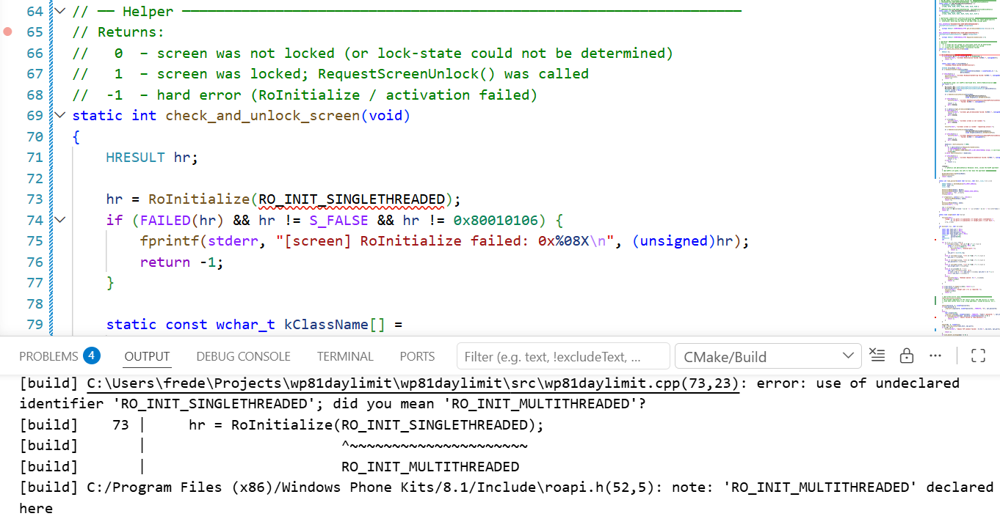
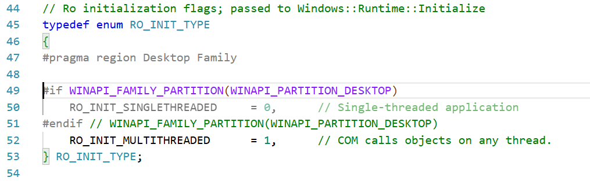
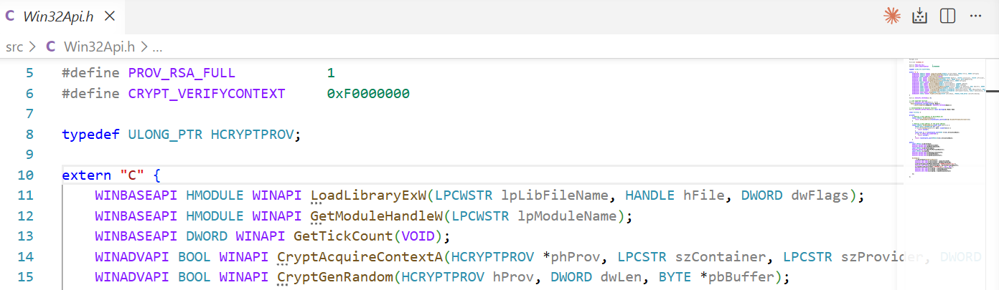
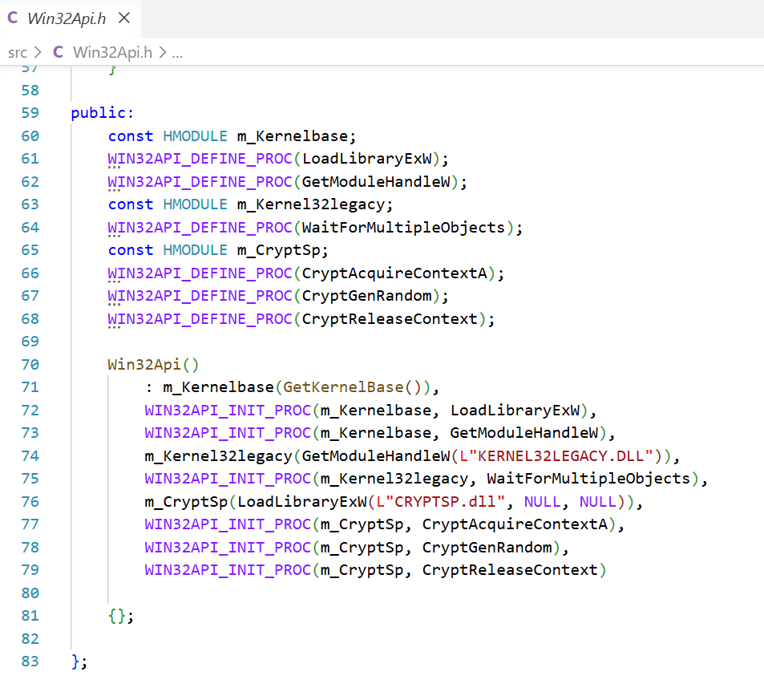

# How to build wp81Example with VSCode, LLVM, CMake and Ninja

## Requirements

- [Install a telnet server on the phone](https://github.com/fredericGette/wp81documentation/tree/main/telnetOverUsb#readme), in order to run the application.
- [LLVM](https://releases.llvm.org/) (tested with LLVM 19), installed in `C:\Program Files\LLVM\`.  
  Make sure `clang-cl.exe` and `lld-link.exe` are present in `C:\Program Files\LLVM\bin\`.
- [CMake](https://cmake.org/download/) 3.20 or later.
- [Ninja](https://ninja-build.org/) build system, accessible from the PATH.
- [Visual Studio Code](https://code.visualstudio.com/) with the following extensions:
  - **C/C++** (Microsoft) — for IntelliSense
  - **CMake Tools** (Microsoft) — for CMake integration
- **Windows Phone 8.1 SDK**, providing headers and ARM libraries in:
  - `C:\Program Files (x86)\Windows Phone Kits\8.1\`
- **Visual Studio 11.0 (VS 2012)** WPSDK headers and ARM libraries in:
  - `C:\Program Files (x86)\Microsoft Visual Studio 11.0\VC\WPSDK\`

## Project structure

```
wp81Example/
├── .vscode/
│   └── c_cpp_properties.json   ← IntelliSense configuration
├── src/
│   ├── wp81Example.cpp
│   └── Win32Api.h
├── CMakeLists.txt              ← build definition
└── CMakePresets.json           ← ARM32 toolchain preset
```

## CMakePresets.json

The preset selects `clang-cl` as both C and C++ compiler, targets `armv7-pc-windows-msvc`, uses Ninja as the generator, and outputs build artifacts to the `build/` subdirectory.

```json
{
    "version": 3,
    "configurePresets": [
        {
            "name": "arm32-windows",
            "displayName": "ARM32 Windows 8.1",
            "generator": "Ninja",
            "binaryDir": "${sourceDir}/build",
            "toolset": {
                "value": "host=x64",
                "strategy": "external"
            },
            "architecture": {
                "value": "arm",
                "strategy": "external"
            },
            "cacheVariables": {
                "CMAKE_C_COMPILER": "C:/Program Files/LLVM/bin/clang-cl.exe",
                "CMAKE_CXX_COMPILER": "C:/Program Files/LLVM/bin/clang-cl.exe",
                "CMAKE_LINKER": "C:/Program Files/LLVM/bin/lld-link.exe",
                "CMAKE_C_FLAGS": "--target=armv7-pc-windows-msvc",
                "CMAKE_CXX_FLAGS": "--target=armv7-pc-windows-msvc",
                "CMAKE_MSVC_RUNTIME_LIBRARY": "MultiThreadedDLL",
                "CMAKE_EXE_LINKER_FLAGS": "/MACHINE:ARM /SUBSYSTEM:CONSOLE /LIBPATH:\"C:/Program Files (x86)/Windows Phone Kits/8.1/lib/ARM\" /LIBPATH:\"C:/Program Files (x86)/Windows Phone Kits/8.1/lib/winv6.3/um/arm\" /LIBPATH:\"C:/Program Files (x86)/Microsoft Visual Studio 11.0/VC/WPSDK/lib/arm\"",
                "CMAKE_TRY_COMPILE_TARGET_TYPE": "STATIC_LIBRARY"
            }
        }
    ]
}
```

> `CMAKE_TRY_COMPILE_TARGET_TYPE` is set to `STATIC_LIBRARY` so that CMake's compiler detection step does not attempt to link an executable for the cross-compilation target.

## CMakeLists.txt

```cmake
cmake_minimum_required(VERSION 3.20)

# Use the name of the current source directory as the project/target name
get_filename_component(APP_NAME ${CMAKE_CURRENT_SOURCE_DIR} NAME)

project(${APP_NAME})

# Collect all .cpp files in src/ automatically
file(GLOB_RECURSE SOURCES "src/*.cpp")

add_executable(${APP_NAME} ${SOURCES})

target_compile_definitions(${APP_NAME} PRIVATE
    _WIN32_WINNT=0x0603
    WINAPI_FAMILY=WINAPI_FAMILY_PHONE_APP
)

target_include_directories(${APP_NAME} PRIVATE
    "C:/Program Files (x86)/Windows Phone Kits/8.1/Include"
    "C:/Program Files (x86)/Windows Phone Kits/8.1/Include/abi"
    "C:/Program Files (x86)/Windows Phone Kits/8.1/Include/mincore"
    "C:/Program Files (x86)/Windows Phone Kits/8.1/Include/minwin"
    "C:/Program Files (x86)/Microsoft Visual Studio 11.0/VC/WPSDK/include"
)

target_compile_options(${APP_NAME} PRIVATE
    /clang:-fno-sized-deallocation
    "SHELL:/external:I \"C:/Program Files (x86)/Windows Phone Kits/8.1/Include\""
    "SHELL:/external:I \"C:/Program Files (x86)/Windows Phone Kits/8.1/Include/abi\""
    "SHELL:/external:I \"C:/Program Files (x86)/Windows Phone Kits/8.1/Include/mincore\""
    "SHELL:/external:I \"C:/Program Files (x86)/Windows Phone Kits/8.1/Include/minwin\""
    "SHELL:/external:I \"C:/Program Files (x86)/Microsoft Visual Studio 11.0/VC/WPSDK/include\""
    /external:W0
)

set(CMAKE_C_STANDARD_LIBRARIES "" CACHE STRING "" FORCE)
set(CMAKE_CXX_STANDARD_LIBRARIES "" CACHE STRING "" FORCE)

target_link_directories(${APP_NAME} PRIVATE
    "C:/Program Files (x86)/Windows Phone Kits/8.1/lib/ARM"
    "C:/Program Files (x86)/Windows Phone Kits/8.1/lib/winv6.3/um/arm"
    "C:/Program Files (x86)/Microsoft Visual Studio 11.0/VC/WPSDK/lib/arm"
)

target_link_libraries(${APP_NAME} PRIVATE
    mincore.lib
)
```

Key points:
- `_WIN32_WINNT=0x0603` targets Windows 8.1 (Windows Phone 8.1).
- `WINAPI_FAMILY=WINAPI_FAMILY_PHONE_APP` restricts the Win32 API surface to what is available on the phone.
- `/external:I` marks SDK headers as system headers so their warnings are suppressed (`/external:W0`).
- `CMAKE_C_STANDARD_LIBRARIES` and `CMAKE_CXX_STANDARD_LIBRARIES` are cleared to avoid CMake injecting host libraries that are not available for the ARM target.
- Only `mincore.lib` is linked — this is the Windows Phone 8.1 umbrella import library, equivalent to the traditional `kernel32.lib` on the phone.

## IntelliSense configuration (.vscode/c_cpp_properties.json)

```json
{
  "configurations": [
    {
      "name": "Win8.1-ARM32",
      "includePath": [
        "C:/Program Files (x86)/Windows Phone Kits/8.1/Include/**",
        "C:/Program Files (x86)/Microsoft Visual Studio 11.0/VC/WPSDK/include/**"
      ],
      "defines": [
        "_WIN32",
        "WINAPI_FAMILY=WINAPI_FAMILY_PHONE_APP",
        "_WIN32_WINNT=0x0603"
      ],
      "compilerPath": "C:/Program Files/LLVM/bin/clang-cl.exe",
      "compilerArgs": [
          "--target=armv7-pc-windows-msvc"
      ],
      "intelliSenseMode": "windows-clang-arm"
    }
  ],
  "version": 4
}
```

### Building from VSCode

Open the folder in VSCode. The CMake Tools extension detects `CMakePresets.json` automatically.

1. Open the Command Palette (`Ctrl+Shift+P`) and run **CMake: Select Configure Preset**, then choose **ARM32 Windows 8.1**.  
2. Run **CMake: Configure** (or click the CMake status-bar button).  
3. Run **CMake: Build** (`F7` or `Ctrl+Shift+B`).  

## Deployment

Build the application with `cmake --build build` (or `[F7]` in VSCode) to generate `build\wp81Example.exe`.  
Then manually copy this file to the shared folder of the phone: `C:\Data\USERS\Public\Documents`

> When you connect your phone with a USB cable, this folder is visible in Windows Explorer on your computer.

## Troubleshoot

### Even with the required includes, some definitions are missing due to the WINAPI_FAMILY_PARTITION



You can either update the content of the include to remove the problematic `#if WINAPI_FAMILY_PARTITION(...`  


Or you can add the missing definitions in a Win32Api.h file.  


This file can also be used to dynamicaly link to a specific library containing a required function.



