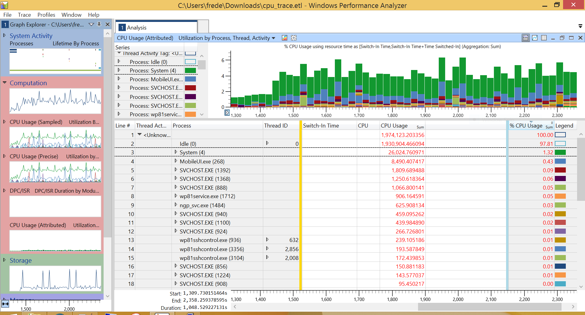

# How to analyse performances

## Requirements

- [Install a telnet server on the phone](../telnetOverUsb/README.md), in order to run applications.


## Windows Performance Recorder

Run the following command to start recording CPU and process lifecycle events directly to a circular memory buffer:

```bat
wpr -start CPU -start GeneralProfile
```

Let it run, then save the trace:

```bat
wpr -stop C:\Data\USERS\Public\Documents\cpu_trace.etl
```

Copy the .etl file to a desktop Windows and open it with WPA:

