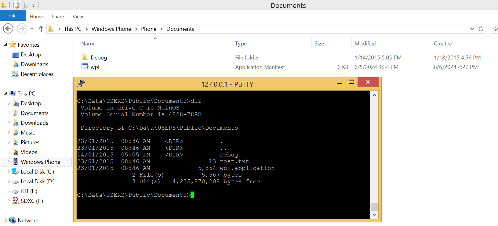
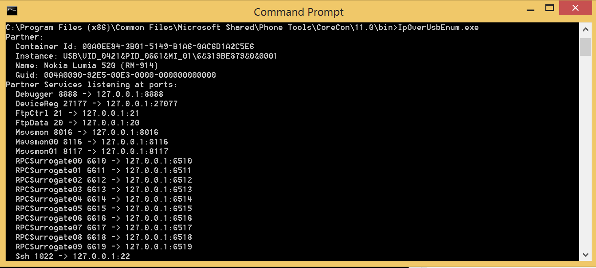
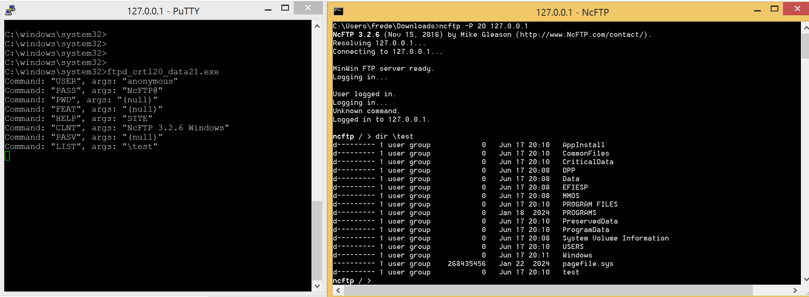
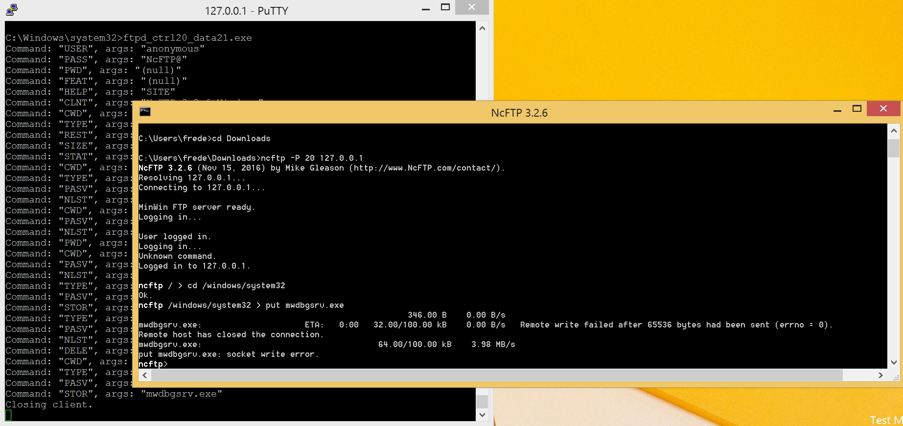

# FTP over USB

## Requirements

- [Install a telnet server on the phone](../telnetOverUsb/README.md), in order to run the ftp server.  

## Install a FTP server on the phone

Copy the file [ftpd_ctrl20_data21.exe](ftpd_ctrl20_data21.exe) into the folder C:\Windows\System32 of your phone.  
To do that, copy the file into the shared folder of your phone, then move the file to the correct folder by using a telnet session.  

> [!NOTE]
> Files added from the computer, into the shared folder, are visible on the phone, but files added from the phone are not visible on the computer.  

## Forward the ports 20 and 21 from the phone to the computer

Add two keys named `FtpCtrl` and `FtpData` in the registry key `HKEY_LOCAL_MACHINE\SOFTWARE\Microsoft\IpOverUsb` of the computer.  

Restart the _IP over USB_ service of the computer to load the new configuration.  

Check the new entries are visible in the result of the command `IpOverUsbEnum` of the computer.  

## Start the ftp server on the phone and start a ftp client on the computer

Example with [NcFTP](https://www.ncftp.com/ncftp/):  

From a telnet session, start ftpd_ctrl20_data21.exe on the phone.  

> [!NOTE]
> ftpd_ctrl20_data21.exe is a modified version of ftpd.exe where the control port is 20 and the passive data port is always 21. This is because I was not able to modify the .exe to use the port 20 for data. 

From a command console, start the ftp client indicating to connect to the port 20 of 127.0.0.1  
Then activate the passive mode with `set passive on`.

> [!WARNING]
> It looks like it's not possible to transfer a file having a size over 64KB.

