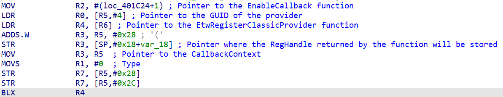
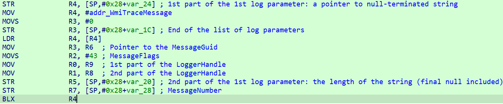

# Remote debug WindowsPhone 8.1 kernel from Windows 8.1

Add the following files in the target phone (coming from C:\Program Files (x86)\Windows Phone Kits\8.1\MSPackages\Merged\arm\fre\Microsoft.MS_KDNETUSB_ON.MSN.MainOS.spkg):
```
	\windows\System32\kd_02_5143.dll
	\windows\System32\kdcom.dll
	\windows\System32\kdnet.dll
	\windows\System32\kdstub.dll
	\windows\System32\kdusb.dll
```

Get the IP of the host computer (Example 192.168.1.16).

Reboot the phone in *Mass storage* mode, see [Key combinations of Windows Phone 8.1](https://github.com/fredericGette/Lumia520/blob/main/content/windows_keys/README.md).  
Then open an Admin Command Prompt.  
And change the BCD configuration of the target phone:
```
bcdedit /store F:\efiesp\efi\Microsoft\Boot\BCD /dbgsettings net HOSTIP:192.168.1.16 PORT:50000 KEY:1.2.3.4
bcdedit /store F:\efiesp\efi\Microsoft\Boot\BCD -set {default} debug on
bcdedit /store F:\efiesp\efi\Microsoft\Boot\BCD -set {default} dbgtransport kdnet.dll
bcdedit /store F:\efiesp\efi\Microsoft\Boot\BCD -set {dbgsettings} busparams 1
```

>[!NOTE]
>In this example *F:* is the letter of the *MainOS* disk drive.  You must change it to match the correct letter.  
>And you must also change the *HOSTIP* to match the IP address of the host computer.  

In the host computer start C:\Program Files (x86)\Microsoft Windows Phone 8 KDBG Connectivity\bin\VirtEth.exe  
Warning: this version of VirtEth requires "Virtual Machine Network Services" which is not available in Windows 10+. Please use Windows 8.1  
For Windows 10 use VirthEth_RS1 as indicated [below](#Debug-with-windows-10).

In case of error, check that "Virtual Machine Network Services" is enable only in one network connection:


Reboot the target phone.

VirtEth should display the following messages:


You can now start the debugger client in the host computer:

C:\Program Files (x86)\Windows Kits\8.1\Debuggers\x64\kd.exe -y C:\Symbols -k net:port=50000,key=1.2.3.4


>[!NOTE]
>You can also use windbg.exe with the same option as kd.exe  

# Others BCD configuration:

To display boot menu:
```
bcdedit /store F:\efiesp\efi\Microsoft\Boot\BCD /set {bootloadersettings} bootmenupolicy legacy
bcdedit /store F:\efiesp\efi\Microsoft\Boot\BCD /set {bootmgr} displaybootmenu on
bcdedit /store F:\efiesp\efi\Microsoft\Boot\BCD /set {bootmgr} timeout 60
bcdedit /store F:\efiesp\efi\Microsoft\Boot\BCD /displayorder {default}
```

To display errors:
```
bcdedit /store F:\efiesp\efi\Microsoft\Boot\BCD -set {globalsettings} booterrorux Standard
```

# Debug with windows 10
Thanks to [Leway213](https://github.com/Leeway213/BSP-aw1689/blob/master/doc/Dev%20Guide.md#2-debug-with-a-virtual-net-over-usb)   
Create a virtual switch in Hyper-V  

Then start VirthEth_RS1.exe

# Usefull kd/windbg command

`.sympath C:\Symbols`  
`.reload`  

See the stack trace  
`k`  

See the list of loaded modules  
`lm`  
See only loaded module matching a pattern  
`lm m oempanel`  
See the list of loaded modules sorted by name  
`lm sm`  

Let the windows phone running  
`g`  

Create an "unresolved" break point (you can set the break even before the loading of the module)    
`bu wp81wiimote!EvtIoDeviceControl`  

List break point  
`bl`  

Display the address and name of the symbol "poDebug" of the module "nt"  
`x /2 nt!poDebug`

Enter into memory (0x821d3628) the double-word values (4 bytes) specified (0xFFFFFFFF)    
`ed 821d3628 0xFFFFFFFF`

Activate kernel debug messages  
`ed nt!poDebug 0x800`  
`ed nt!poDebug 0xFFFFFFFE`  
`ed nt!Kd_DEFAULT_Mask 0xFFFFFFFF`  
`ed nt!Kd_WIN2000_Mask 0xFFFFFFFF`  

Set the r4 register for the current thread to 0xFFFFFFFF  
`r r4=FFFFFFFF`

Step over   
`p`

Step into  
`t`

Display memory  
`dc addr`  

Display the address of a module added to a value   
`?qci2c8930+0x2376`

Force load modules  
`!analyze`

Reboot the phone (use with the command line `-d` to break as soon as a kernel module is loaded)   
`.reboot`

List WMI loggers  
`!wmitrace.strdump`

Display information about a WDFIOTARGET handle:  
`!wdfkd.wdfiotarget 73cb0130`

Display all the ANSI strings contained in a buffer:  
`s -sa 8b5c4000 L20000`  
0x8b5c4000 = address of the buffer  
0x20000 = size of the buffer  

Display in _GUID format_ the memory at an address:  
`dt _GUID 8bc9e208`

# Notes

When a Windows phone is configured to use KDNET over USB, Media Transport Protocol (MTP) is disabled. On the host computer, in File Explorer, you will not see the usual phone folders (Documents, Music, Pictures, and the like).  

If you want to use MTP, turn off kernel-mode debugging for the phone.  

In mass storage mode:  

```
bcdedit /store F:\efiesp\efi\Microsoft\Boot\BCD /deletevalue {default} debug
``` 

# Use ETW/WPP

Often, kernel drivers are using ETW/WPP as their logging mechanism. Without the orignal .pdb file, it is difficult to read these logs.  
But we can nevertheless try to make some of these logs readable by manually creating a .tmf file. 

## Find the GUID of the provider

The [provider](https://learn.microsoft.com/en-us/windows-hardware/test/weg/instrumenting-your-code-with-etw#etw-architecture) generates the logs. It is identified by a GUID.   
Find a call to the function [EtwRegisterClassicProvider](https://www.geoffchappell.com/studies/windows/km/ntoskrnl/api/etw/register/registerclassicprovider.htm) or [EtwRegister](https://www.geoffchappell.com/studies/windows/km/ntoskrnl/api/etw/register/register.htm), the first parameter of this function is a pointer to the GUID of the provider.  



## Find the logs

Find the calls to the function [WmiTraceMessage](https://learn.microsoft.com/en-us/windows-hardware/drivers/ddi/wdm/nf-wdm-wmitracemessage) and note the value of the _r3_ register. This is a pointer to the _MessageGuid_.  
Note also the first parameter put in the stack just before the call of the function. This parameter is the _MessageNumber_.  
The others parameters put in the stack are the parameters of the log (each parameter is composed of 2 parts as indicated in the description of the function).    



## Write the .tmf file

Using the information collected previously, we can start to manually write the [.tmf file](https://learn.microsoft.com/en-us/windows-hardware/drivers/devtest/trace-message-format-file):

```
c1cbcc0f-8890-ecb9-5236-20d1c4d45820 qcwcn8930_guid01
#typev DriverEntry28 28  "%0!DriverEntry!%10!s!"
{
    arg10,ItemString
}
```

In this example, `c1cbcc0f-8890-ecb9-5236-20d1c4d45820` is the _MessageGuid_.  
`qcwcn8930_guid01` is a name given to this class of message (we can choose whatever we want).  

Then we have to create a `#typev` block for each log identified by a _MessageNumber_.  
`28` is the _MessageNumber_ and `DriverEntry28` is the name given to this log (we can choose whatever we want).  
`"%0!DriverEntry!%10!s!"` is the template we want to print.  
`DriverEntry` is the name of the function where _WmiTraceMessage_ is called.  
`%0` is a prefix which, by default, contains some information like the process ID, the thread ID and the timestamp of the log.  
`%10` is the first parameter of the log and we want to print it as a string `!s!`.  
`arg10` is the name of the first log parameter (we can choose whatever we want).  
`ItemString` indicates the type of this parameter (here a null-terminated string).  

## Use the .tmf file

Use the `-d` option of windbg to break as soon as possible when the phone starts in order to break before the start of the driver we want to read the logs for example.  
Put a unresolved break point at the start of the DriverEntry function of the driver:  
```
bu qcwcn8930!DriverEntry
```

Go to this break point:  
```
g
```

Start a new logger named `log01` (we can choose another name) with _live tracing_ activated (option `-kd`):  
```
!wmitrace.start log01 -kd
```
>[!NOTE]
>We cannot start a logger as soon as the phone starts because it depends on some resources created later.  
>That's why we put a breakpoint just before the place where the logs are generated, in order to create the logger before the first log.  

Enable the provider we are interested in:  
```
!wmitrace.enable log01 {98D8E493-33D4-4802-AD80-4DD111760D19} -level 5 -flag 0xFFFFFFFF
```
`log01` is the name of our logger.  
`{98D8E493-33D4-4802-AD80-4DD111760D19}` is the GUID of the provider.  
`-level 5` is the log level [(5=Verbose)](https://wtrace.net/guides/etw/#description).  
`-flag 0xFFFFFFFF` don't filter any event (I'm not sure of the purpose of this option).

Use our .tmf file to decode the logs:  
```
!wmitrace.tmffile C:\Users\frede\Documents\qcwcn8930.tmf
```

Let the execution of the driver continues in order to generate the logs:  
```
g
```

Example of a log correctly decoded:  
```
[1]0004.0084::06/03/2025-14:16:22.979 [qcwcn8930_guid01]!DriverEntry!Enter
```

Example of a log missing in the .tmf file:  
```
Unknown( 58): GUID=c1cbcc0f-8890-ecb9-5236-20d1c4d45820 (No Format Information found).
```
`58` is the _MessageNumber_.  
`c1cbcc0f-8890-ecb9-5236-20d1c4d45820` is the _MessageGuid_. 

>[!NOTE]
>You can also read again the logs after their creation:  
>```
>!wmitrace.logdump log01 -tmf C:\Users\frede\Documents\qcwcn8930.tmf
>``` 
>And in this case, you don't need to add the option `-kd` when you start your logger.

Resources:  
https://gist.github.com/mattifestation/4bc43dfbd46429ec18ce60a2ea1bcf3c
https://github.com/mattifestation/MSFTTraceMessageFormat/blob/master/provcore.tmf
https://github.com/antoxar/WPPTracingSample/blob/master/sample/WppTracing/WppConfig/Rev1/defaultwpp.ini
