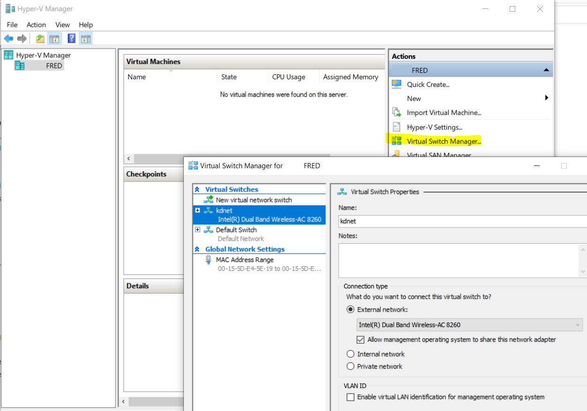

# Remote debug WindowsPhone 8.1 kernel from Windows 8.1

Add the following files in the target phone (coming from C:\Program Files (x86)\Windows Phone Kits\8.1\MSPackages\Merged\arm\fre\Microsoft.MS_KDNETUSB_ON.MSN.MainOS.spkg):
```
	\windows\System32\kd_02_5143.dll
	\windows\System32\kdcom.dll
	\windows\System32\kdnet.dll
	\windows\System32\kdstub.dll
	\windows\System32\kdusb.dll
```

Get the IP of the host computer (Example 192.168.1.16).

Change the BCD configuration of the target phone:
```
bcdedit /store F:\efiesp\efi\Microsoft\Boot\BCD /dbgsettings net HOSTIP:192.168.1.16 PORT:50000 KEY:1.2.3.4
bcdedit /store F:\efiesp\efi\Microsoft\Boot\BCD -set {default} debug on
bcdedit /store F:\efiesp\efi\Microsoft\Boot\BCD -set {default} dbgtransport kdnet.dll
bcdedit /store F:\efiesp\efi\Microsoft\Boot\BCD -set {dbgsettings} busparams 1
```

In the host computer start C:\Program Files (x86)\Microsoft Windows Phone 8 KDBG Connectivity\bin\VirtEth.exe  
Warning: this version of VirtEth requires "Virtual Machine Network Services" which is not available in Windows 10+. Please use Windows 8.1  
For Windows 10 use VirthEth_RS1 as indicated [below](#Debug-with-windows-10).

In case of error, check that "Virtual Machine Network Services" is enable only in one network connection:


Reboot the target phone.

VirtEth should display the following messages:


You can now start the debugger client in the host computer:

C:\Program Files (x86)\Windows Kits\8.1\Debuggers\x64\kd.exe -y C:\Symbols -k net:port=50000,key=1.2.3.4


# Others BCD configuration:

To display boot menu:
```
bcdedit /store F:\efiesp\efi\Microsoft\Boot\BCD /set {bootloadersettings} bootmenupolicy legacy
bcdedit /store F:\efiesp\efi\Microsoft\Boot\BCD /set {bootmgr} displaybootmenu on
bcdedit /store F:\efiesp\efi\Microsoft\Boot\BCD /set {bootmgr} timeout 60
bcdedit /store F:\efiesp\efi\Microsoft\Boot\BCD /displayorder {default}
```

To display errors:
```
bcdedit /store F:\efiesp\efi\Microsoft\Boot\BCD -set {globalsettings} booterrorux Standard
```

# Debug with windows 10
Thanks to [Leway213](https://github.com/Leeway213/BSP-aw1689/blob/master/doc/Dev%20Guide.md#2-debug-with-a-virtual-net-over-usb)   
Create a virtual switch in Hyper-V  

Then start VirthEth_RS1.exe

# Usefull kd command

.sympath C:\Symbols  
.reload  

See the stack trace:  
k  

See the list of loaded modules:   
lm  

Let the windows phone running:
g  

Break:  
ctrl+c  

Create an "unresolved" break point:  
bu wp81wiimote!EvtIoDeviceControl  

List break point:  
bl  

Step by step:
p

# Notes

When a Windows phone is configured to use KDNET over USB, Media Transport Protocol (MTP) is disabled. On the host computer, in File Explorer, you will not see the usual phone folders (Documents, Music, Pictures, and the like).  

If you want to use MTP, turn off kernel-mode debugging for the phone.  

In mass storage mode:  

```
bcdedit /store F:\efiesp\efi\Microsoft\Boot\BCD /deletevalue {default} debug
``` 
