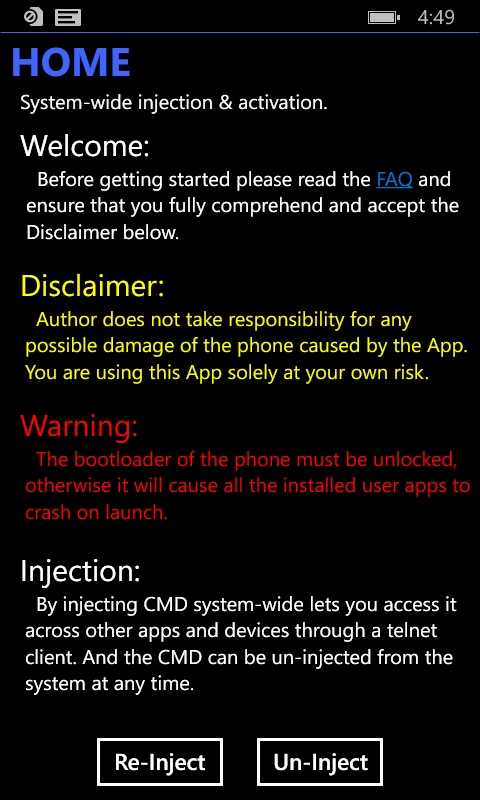
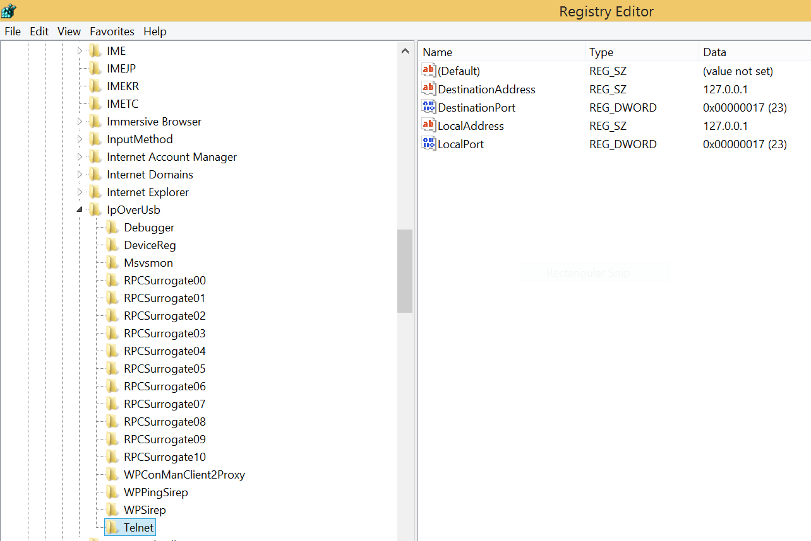
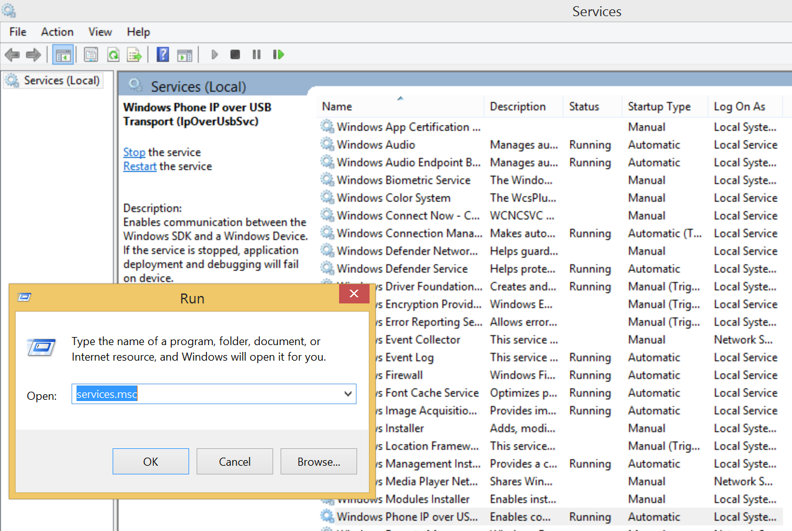
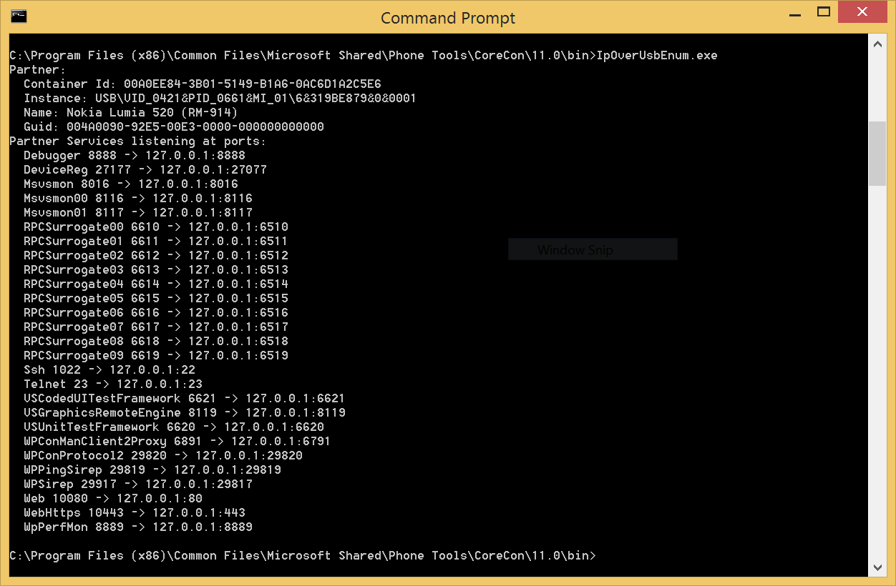

# Telnet over USB

## Requirements

- Unlock/Root the WindowsPhone using [WPinternals](https://github.com/ReneLergner/WPinternals).
- Install [CMD.Injector](https://github.com/fadilfadz01/CMD.Injector_WP8) on the phone.
- Install the WindowsPhone SDK on the client computer.

## Install a telnet server on the phone

## Forward the port 23 from the phone to the computer

Add a key named `Telnet` and the following values in the registry key `HKEY_LOCAL_MACHINE\SOFTWARE\Microsoft\IpOverUsb` of the computer.  

Restart the _IP over USB_ service of the computer to load the new configuration.  

Check the new entry _Telnet_ is visible in the result of the command `IpOverUsbEnum` of the computer.  

