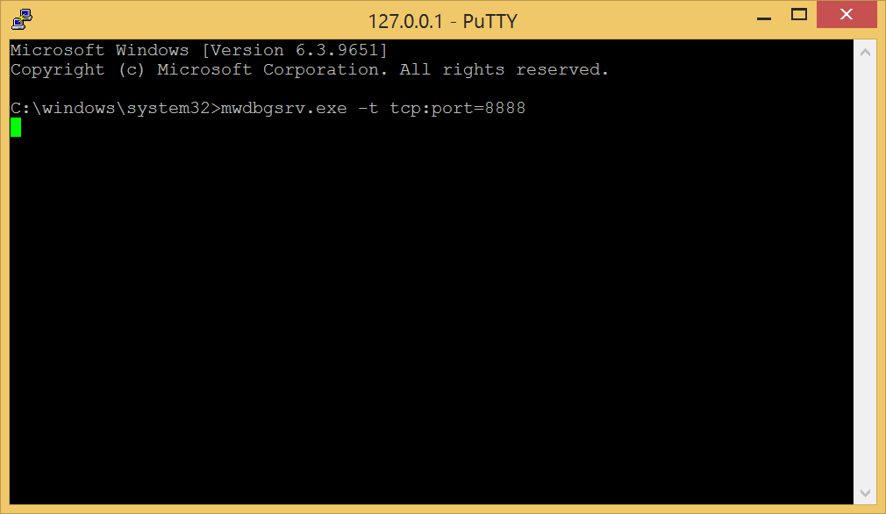
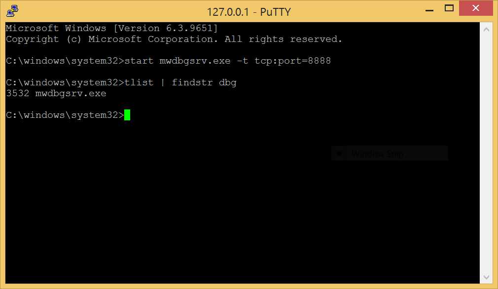
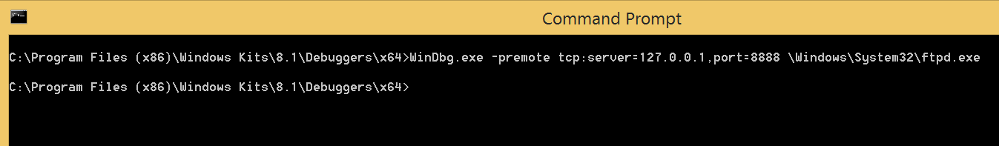
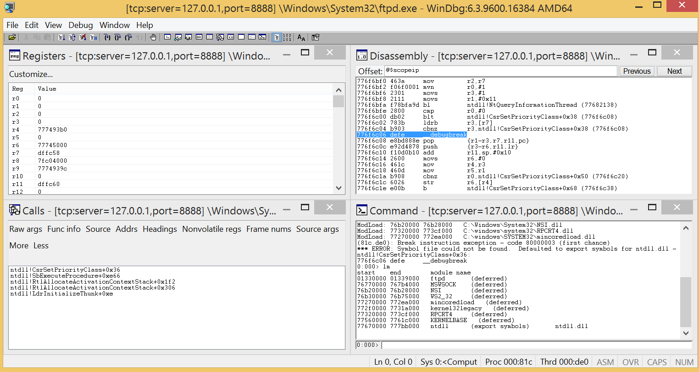

# Remote debug a WindowsPhone 8.1 program in user-mode

## Requirements

- [Install a telnet server on the phone](../telnetOverUsb/README.md), in order to run the debug server.

## Install the debug server on the phone

Copy the file [mwdbgsrv.exe](mwdbgsrv.exe) into the folder C:\Windows\System32 of your phone.  
To do that, copy the file into the shared folder of your phone, then move the file to the correct folder by using a telnet session.  

## Forward the port 8888 from the phone to the computer

This port must be already configured in the _IP over USB_ service  of your computer. Otherwise add a new entry in the registry key `HKEY_LOCAL_MACHINE\SOFTWARE\Microsoft\IpOverUsb`.  

## Start a remote debug session

Start the debug server on the phone. And indicate the port 8888 for the communication.  

> [!NOTE]
> You can also start the debug session as a background process as it doesn't log anything.
> 

Start the debug client on the computer. And indicate the same port for the communication.  
In this example, we want to remote debug the executable ftpd.exe of the phone.  

