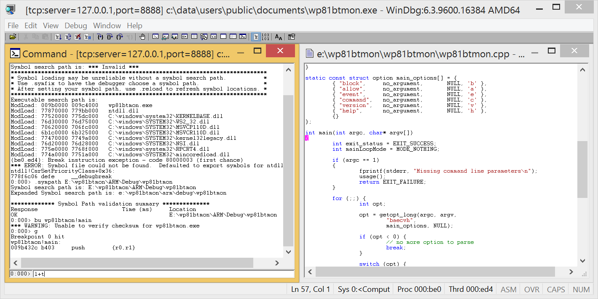

# Remote debug a WindowsPhone 8.1 program in user-mode

## Requirements

- [Install a telnet server on the phone](../telnetOverUsb/README.md), in order to run the process server.

## Install the process server on the phone

Copy the file [mwdbgsrv.exe](mwdbgsrv.exe) into the folder C:\Windows\System32 of your phone.  
To do that, copy the file into the shared folder of your phone, then move the file to the correct folder by using a telnet session.  

## Forward the port 8888 from the phone to the computer

This port must be already configured in the _IP over USB_ service  of your computer. Otherwise add a new entry in the registry key `HKEY_LOCAL_MACHINE\SOFTWARE\Microsoft\IpOverUsb`.  

## Start a remote debug session

Start the process server on the phone. And indicate the port 8888 for the communication.  

> [!NOTE]
> You can also start the debug session as a background process as it doesn't log anything.
> 

Start the smart client on the computer. And indicate the same port for the communication.  
In this example, we want to remote debug the executable ftpd.exe of the phone.  

## Debug a running programm with source code

Start the process server on the phone.  

Find the PID of the running process (2376 is the example below).  

Start the smart client on the computer. And indicate the PID of the running process.  

Add the path of the folder containing the .pdb of the executable.  

Add a breakpoint at the start of a function.  

Continue the execution until the breakpoint.  

WinDbg automatically opens the source code when the breakpoint is hit.  
You can use the command `l+t` to step one source line at a time (instead of one assembly instruction at a time).  

