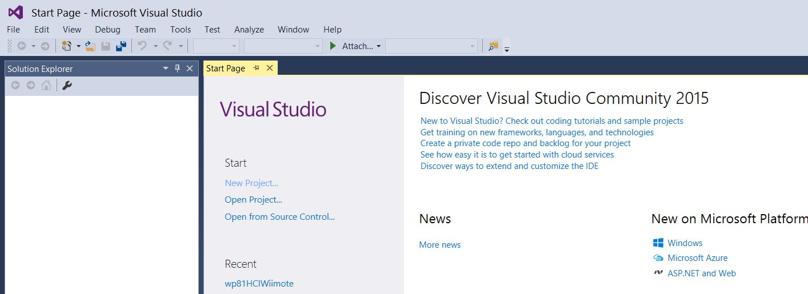

See below how to bypass the "developer license" check in Visual Studio 2015 and Windows 8.1  

Tested with Visual Studio Community 2015 (Version 14.0.25431.01 Update 3) and Windows 8.1 Pro 64-bit Operating System, x64-based processor.  

# Case #1: Your already have a "developer license", but it is expired and you get error 0x80245004 when you try to renew it.  
The "developer license check" occurs when you open your project 


or when you debug it on a windows phone device.  


En after having failed to contact the license server, you get this error message:  


## Solution
Replace file C:\Windows\SysWOW64\WSClient.dll (SHA256 Hash ????)
by this [one](SysWOW64/WSClient.dll) (SHA256 Hash 35ABD0312844D715EA96AEEDE3396DCB7B5C7C9008C0FAE072F6340DFD135C10)  
or use a disk editor (like [HxD](https://mh-nexus.de/en/hxd/)) to search and replace the following bytes in your disk (you should find only one occurrence of it):  
| Action | Value |
| --- | --- |
| search | `11 48 74 0a 48 75 24 bf 17 03 09 80 eb 0b 33 ff` |
| replace by | `11 48 74 0a 48 75 24 bf 00 00 00 00 eb 0b 33 ff` |

# Case #2: You don't have any "developer license".

TODO  

# Explanations

Visual Studio calls the function CheckDeveloperLicense of C:\Windows\SysWOW64\WSClient.dll and then - in case of failure of the check - it calls the function AcquireDeveloperLicense of this same library to renew the "developer license".


This is visible with windbg:  
- Open an Administrator Command Prompt.
- Go to `C:\Program Files (x86)\Windows Kits\8.1\Debuggers\x64` or where your windbg is located.
- Run the `tasklist` command to list the running processes and get the PID of Visual Studio.

- Start windbg with the PID of the process of Visual Studio in parameter: `windbg -p 5608`
- In the "Command" window of windbg, list the modules with the command `lm`. You should see WSClient in the result.

- Still in the "Command" window of windbg, list the exported functions of WSClient with `x WSClient!*`. You should see the function `CheckDeveloperLicense`.  

- Still in the "Command" window of windbg, enter the command `bu WSClient!CheckDeveloperLicense` to put a breakpoint at the beginning of the function `CheckDeveloperLicense`. You could check this in the "Breakpoints" window:

- Hit F5 (Go) to let Visual Studio run freely.

- In Visual Studio, trigger the "developer license check" by trying to debug your project on a WindowsPhone device for example.
- Now you can see that the function CheckDeveloperLicense of WSClient is called (you can browse the different threads to find the one calling this function)  

- You can also hit F10 (Step Over) to follow step-by-step the execution of the function (beware! this is a very long function).

The function `CheckDeveloperLicense` returns an error code:
- ErrorCanceledHR 0x800704C7 
- ErrorNotFoundHR 0x80070490
- ErrorExpiredHR 0x80090317

You can get this information thanks to the Powershell Cmdlet `Get-WindowsDeveloperLicense`.  
This cmdlet displays the validity of the developer license and its expiration date.


You can find some information about this cmdlet in the following folders:  
```
C:\Windows\System32\WindowsPowerShell\v1.0\Modules\WindowsDeveloperLicense
C:\Windows\Microsoft.NET\assembly\GAC_MSIL\Microsoft.Windows.DeveloperLicense.Commands
C:\Windows\Microsoft.NET\assembly\GAC_MSIL\Microsoft.Windows.DeveloperLicense.Commands.Resources
```

In particular, `C:\Windows\Microsoft.NET\assembly\GAC_MSIL\Microsoft.Windows.DeveloperLicense.Commands` contains the code of the cmdlet : `Microsoft.Windows.DeveloperLicense.Commands.dll` which we can easily read with a .NET decompiler (like JustDecompile for example).

The decompiled version of the cmdlet is using some native functions exported by WSClient.dll:  


We can also take a look inside the GetWindowsDeveloperLicenseCommand to see how the native function is used.


And look also at the native constants to find the different return codes of the native functions.


__Note__: the Powershell Cmdlet `Get-WindowsDeveloperLicense` is using C:\Windows\System32\WSClient.dll whereas Visual Studio is calling the Wow64 version of this library, but there is very little differences between the two.

With all these information, we can now open the WSClient.dll in a disassembler (like [Ghidra](https://ghidra-sre.org/)) to find a way to change the return code of the function `CheckDeveloperLicense`.  
Fortunately, there's only one place - near the end of the function - where the return code 'ErrorExpiredHR 0x80090317' is set.


By changing this value to 0x00000000 we can transform it into a "success":


__Note__: we can do the same modification in the "System32" version of WSClient.dll


Replace file C:\Windows\System32\WSClient.dll (SHA256 Hash ????)
by this [one](System32/WSClient.dll) (SHA256 Hash 32CB2F1E08FC3542CC0AC0C76EBA8B4CB4815D01999605BA3CCA7CFDF1991385)  
or use a disk editor (like [HxD](https://mh-nexus.de/en/hxd/)) to search and replace the following bytes in your disk (you should find only one occurrence of it):  
| Action | Value |
| --- | --- |
| search | `c9 74 0e ff c9 75 37 be 17 03 09 80 e9 8f d3 ff` |
| replace by | `c9 74 0e ff c9 75 37 be 00 00 00 00 e9 8f d3 ff` |
